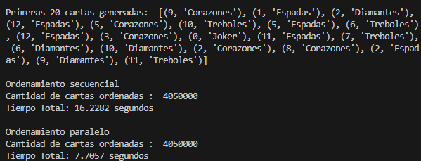

# **Programación Secuencial y Paralela para el Ordenamiento de Cartas**

Este proyecto implementa y compara algoritmos de ordenamiento secuencial y paralelo para un conjunto masivo de barajas de cartas (54 cartas por baraja). El objetivo principal es demostrar cómo la paralelización puede reducir significativamente el tiempo necesario para ordenar grandes volúmenes de datos.

El programa utiliza el algoritmo **MergeSort** para realizar el ordenamiento de las cartas, distribuyéndolas primero por palo y luego en orden ascendente dentro de cada palo. Los palos están clasificados en el siguiente orden: **corazones**, **tréboles**, **espadas**, **diamantes** y, finalmente, **jokers**.

---

## **Resultados y Comparación**
El proyecto evidencia que:
- **Ordenamiento secuencial**: Consume más tiempo debido a la ejecución en un solo núcleo de procesamiento.
- **Ordenamiento paralelo**: Reduce el tiempo total de ejecución al distribuir el trabajo entre múltiples procesos.

La comparación entre ambos enfoques resalta las ventajas de la paralelización en el manejo de grandes conjuntos de datos.

---

## **Ejecución del Programa**

El programa se puede ejecutar fácilmente y genera resultados tanto para el ordenamiento secuencial como para el paralelo.

### **Ejemplo de Ejecución**
A continuación, se muestra un ejemplo del programa en acción:



---

## **Contenido del Proyecto**
El repositorio incluye los siguientes archivos y módulos clave:

- **`Main.py`**:
  Archivo principal que coordina la ejecución de los algoritmos secuencial y paralelo.

- **`Cartas.py`**:
  Módulo encargado de crear las barajas de cartas, incluyendo los 4 palos (corazones, tréboles, espadas y diamantes) y los jokers.

- **`MergeSort.py`**:
  Implementación del algoritmo de ordenamiento MergeSort, utilizado tanto en el enfoque secuencial como en el paralelo.

- **`Secuencial.py`**:
  Lógica para el ordenamiento secuencial de las cartas.

- **`Paralela.py`**:
  Implementación del ordenamiento paralelo, utilizando el módulo `multiprocessing` para distribuir el trabajo entre múltiples núcleos.

---

## **Requisitos del Sistema**

Para ejecutar este proyecto, necesitas:

- Python 3.8 o superior.
- Módulos estándar de Python: `multiprocessing`, `time`, `random`.

---

## **Cómo Ejecutar el Proyecto**

1. Clona este repositorio:
   ```bash
   git clone https://github.com/JoseAntonioUNMSM/Sequential-and-parallel-programming.git
